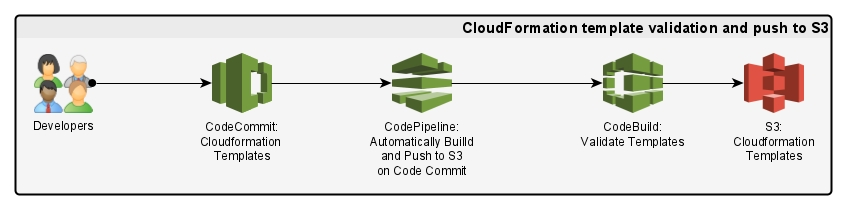

### Description

#### Folder layout
* ```buildcomponents``` example build components for EC2ImageBuilder
* ```cloudformation``` example cloudformation templates
* ```testcomponents``` example test componments for EC2ImageBuilder

### Introduction




### Architecture

### AWS CodeCommit
Our CodeCommit repository contains all of the Cloudformation templates required to deploy all of the EC2ImageBuilder resources which include :-

  * Infrastructure configurations
  * Distribution configurations
  * Build components
  * Test components
  * Image recipes
  * Image pipelines

### AWS CodeBuild
CodeBuild provides the Continous Integration component of our pipeline, it is responsible for pulling in out source code and performing the validation steps that are described in the buildspec files.

### AWS CodePipeline
In addition to CodeBuild, we are using CodePipeline to validates the CloudFormation templates and push them to our S3 bucket. The pipeline calls the corresponding CodeBuild project to validate each template, then deploys the valid CloudFormation templates to S3.

```testing```
